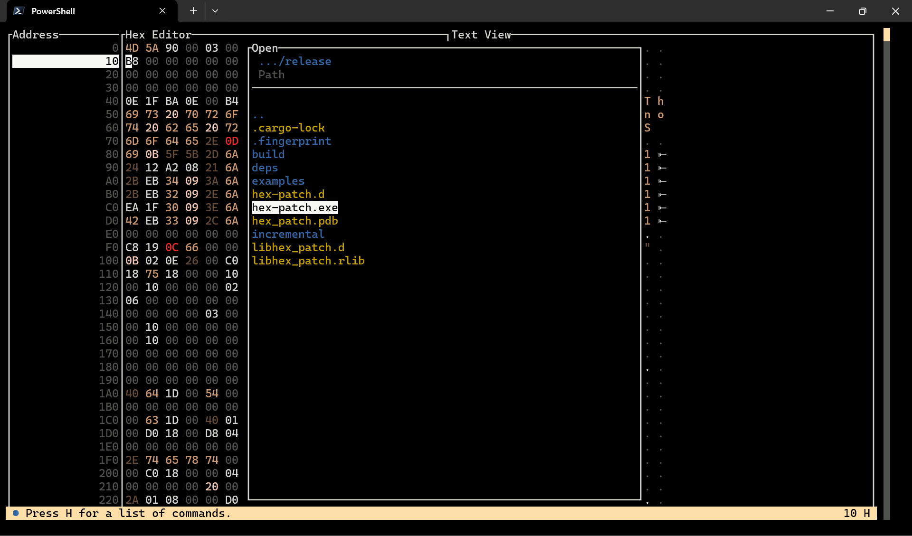
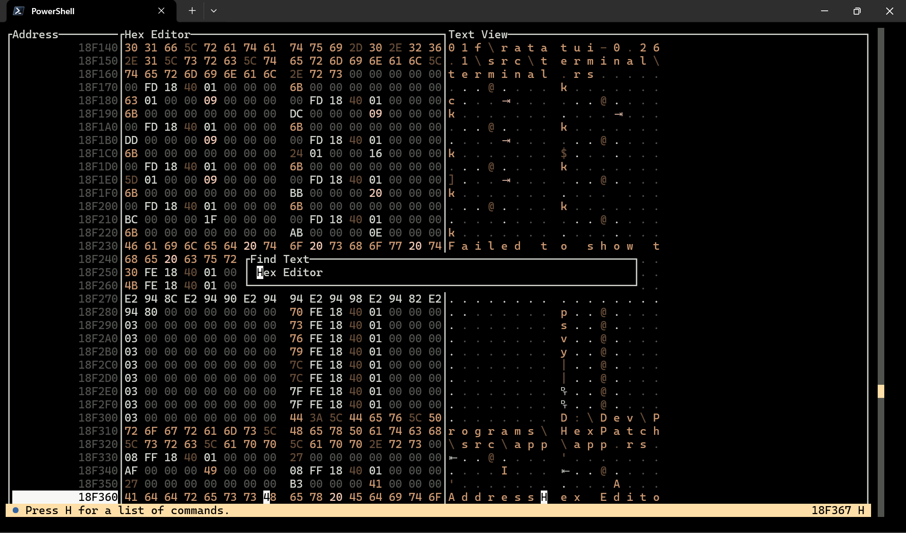
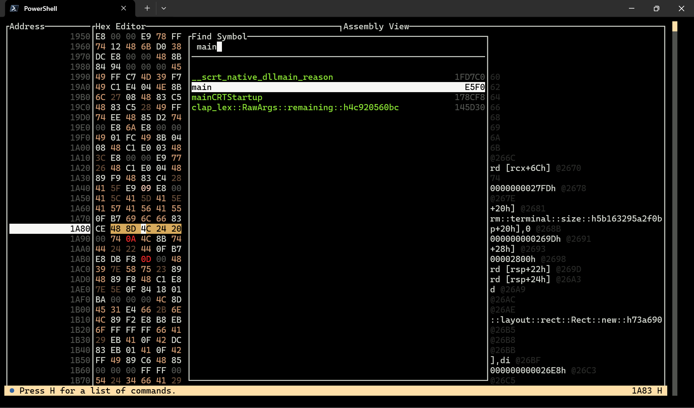

#  HexPatch

[](https://github.com/Etto48/HexPatch/actions/workflows/rust.yml) [](https://github.com/Etto48/HexPatch/actions/workflows/rust-clippy.yml)

HexPatch is a binary patcher and editor with terminal user interface (TUI), it's capable of disassembling instructions and assembling patches.
It supports a variety of architectures and file formats.
Also, it can edit remote files via SSH.

## Installation

You will need the Rust toolchain, you can get it [here](https://www.rust-lang.org/tools/install).

```bash
git clone https://github.com/Etto48/HexPatch.git
cd HexPatch
cargo install --path .
```

## SSH connection

In order to connect via SSH, you can use the following command:

```bash
hex-patch --ssh <user>@<host>[:<port>] [--password <password>] [additional arguments]
```

If you don't specify a password, the client must be set up with keypair authentication and you must have a key in your `~/.ssh` directory.

Keys are searched in the following order:

- id_rsa
- id_ed25519
- id_ecdsa
- id_dsa

The first key found will be used.

## Supported file formats and architectures

The following file formats are supported:

- Coff
- CoffBig
- Elf32
- Elf64
- MachO32
- MachO64
- Pe32
- Pe64
- Xcoff32
- Xcoff64

The following architectures are supported:

- Aarch64
- Aarch64_Ilp32
- Arm
- I386
- X86_64
- X86_64_X32
- Mips
- Mips64
- PowerPc
- PowerPc64
- Riscv32
- Riscv64
- S390x
- Sparc64

## Features

- Help menu
    

- Log
    

- Text view
    

- Jump to address
    
    Jump to a virtual address with `v0x` or to a file offset with `0x`. You can also jump to symbols and sections.

- Open file
    

- Run command
    

- Find text
    

- Find symbol
    

- Insert Text
    

- Patch
    

## Known issues

- Some key combinations may not work as expected, notably `SHIFT + ENTER` on VSCode terminal. Please refer to [this issue](https://github.com/crossterm-rs/crossterm/issues/685) for more information. Unfortunately, this behavior is out of my control.
- If you try to write an invalid relative jump instruction with more than one register (e.g. `jmp [rip+rax]`) in X86 architectures the program will crash. This problem depends on the `keystone-engine` crate, and it's out of my control.

## Special thanks

Thanks to [Lorenzo Colombini](https://github.com/Lorenzinco) for the instruction highlighting.
